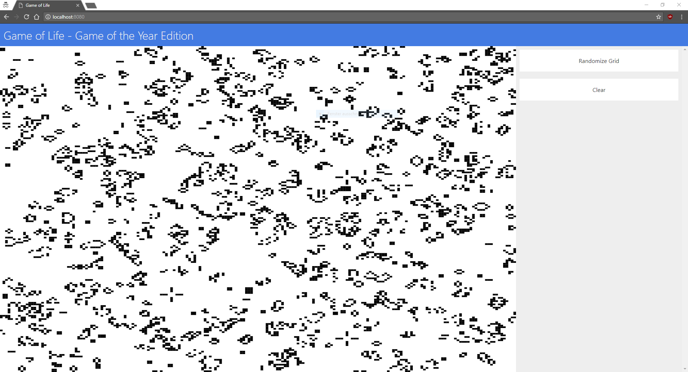

# Game of Life Client
This is a game of life client application which connects to a [server](https://github.com/Mindar/golife-server) and displays the game. The interface provides utilities to modify the game map. Right now the only supported game (on both client- and server-side) is Game of Life. In the future other grid-based games will be added. Below you can see a screenshot of the current user interface.



## Build Instructions
To build this project, first run ```npm install``` in the project's root directory. Once all dependencies are installed, you can run ```webpack``` to compile and bundle the project. If you want to use the project afterwards you'll need a game-server, as this project is just a user interface and does not provide any game logic. You can find it [here](https://github.com/Mindar/golife-server). Follow the instructions on the linked page to finish installation.